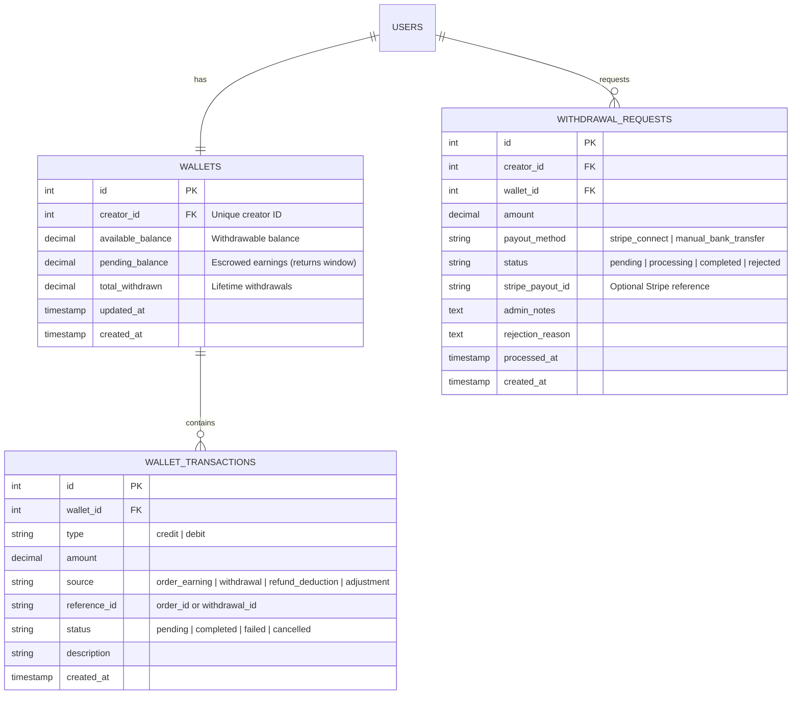

# Wallet Withdrawal & Pricing Flow Design (Creator Platform)

This document details the architectural layout, pricing calculations, database schema, and dashboard flows for the **Wallet Withdrawal System** and the **White-labeled Printify Pricing Flow**. 

---

## 1. White-Labeled Pricing Flow & Profit Calculations

To keep the platform white-labeled:
* **Printify** is never shown to the customer or the creator. It is referred to as **Production Cost** or **Supplier Cost**.
* Pricing calculates automatically in a chain: **Printify Cost $\rightarrow$ Loka Cost (Creator Base Price) $\rightarrow$ Customer Retail Price**.

### Pricing Formulas

| Term | Symbol | Definition / Source |
| :--- | :--- | :--- |
| **Printify Cost** | $P_c$ | The base wholesale cost of the product + shipping fetched from the Printify API. |
| **Loka Base Cost** | $L_b$ | The cost shown to the creator. It includes Loka's **35% markup**. <br> $$L_b = P_c \times 1.35$$ |
| **Retail Price** | $R_p$ | The final price the customer pays. Set by the creator via their markup ($M_c$). <br> $$R_p = L_b \times (1 + M_c)$$ |

### Profit / Split Example
If a t-shirt has a **Printify Cost ($P_c$)** of **$10.00**:
1. **Loka's Base Cost ($L_b$)**: $10.00 \times 1.35 = $**$13.50** (Shown to the creator as the production cost).
2. **Creator Sets Retail Price ($R_p$)**: Creator adds a 40% markup on the $13.50 base. <br> $13.50 \times 1.40 = $**$18.90** (Shown to the customers).
3. **Distribution on Order Payment**:
   * **Customer Pays**: $18.90
   * **Printify Cost (Fulfillment)**: $10.00 (charged to Loka to fulfill the order).
   * **Loka's Markup Revenue**: $13.50 - $10.00 = **$3.50** (used to pay Stripe processing fees and platform profit).
   * **Creator's Profit (Net Commission)**: $18.90 - $13.50 = **$5.40** (credited to the creator's wallet).

---

## 2. Database Schema Design (Backend)

To support wallet tracking, transactions, and withdrawal requests, we will add three tables to the database.



### Table Definitions (SQL DDL Example)

```sql
-- 1. Wallets
CREATE TABLE wallets (
    id SERIAL PRIMARY KEY,
    creator_id INT UNIQUE NOT NULL REFERENCES users(id) ON DELETE CASCADE,
    available_balance DECIMAL(12, 2) NOT NULL DEFAULT 0.00,
    pending_balance DECIMAL(12, 2) NOT NULL DEFAULT 0.00,
    total_withdrawn DECIMAL(12, 2) NOT NULL DEFAULT 0.00,
    created_at TIMESTAMP WITH TIME ZONE DEFAULT CURRENT_TIMESTAMP,
    updated_at TIMESTAMP WITH TIME ZONE DEFAULT CURRENT_TIMESTAMP
);

-- 2. Wallet Transactions (Audit Trail)
CREATE TABLE wallet_transactions (
    id SERIAL PRIMARY KEY,
    wallet_id INT NOT NULL REFERENCES wallets(id) ON DELETE CASCADE,
    type VARCHAR(10) NOT NULL, -- 'credit' or 'debit'
    amount DECIMAL(12, 2) NOT NULL,
    source VARCHAR(30) NOT NULL, -- 'order_earning', 'withdrawal', 'refund_deduction', 'admin_adjustment'
    reference_id VARCHAR(50), -- e.g., Order ID string or Payout ID string
    status VARCHAR(20) NOT NULL DEFAULT 'completed', -- 'pending', 'completed', 'failed', 'cancelled'
    description TEXT,
    created_at TIMESTAMP WITH TIME ZONE DEFAULT CURRENT_TIMESTAMP
);

-- 3. Withdrawal Requests
CREATE TABLE withdrawal_requests (
    id SERIAL PRIMARY KEY,
    creator_id INT NOT NULL REFERENCES users(id) ON DELETE CASCADE,
    wallet_id INT NOT NULL REFERENCES wallets(id) ON DELETE CASCADE,
    amount DECIMAL(12, 2) NOT NULL,
    payout_method VARCHAR(30) NOT NULL DEFAULT 'manual_bank_transfer', -- 'stripe_connect', 'manual_bank_transfer'
    status VARCHAR(20) NOT NULL DEFAULT 'pending', -- 'pending', 'processing', 'completed', 'rejected'
    stripe_payout_id VARCHAR(100),
    admin_notes TEXT,
    rejection_reason TEXT,
    processed_at TIMESTAMP WITH TIME ZONE,
    created_at TIMESTAMP WITH TIME ZONE DEFAULT CURRENT_TIMESTAMP
);
```

---

## 3. Step-by-Step Payout & Withdrawal Workflow

### Step 1: Order Placement & Processing
1. Customer buys product for **$18.90** via Stripe on the frontend.
2. Webhook triggers order completion.
3. Backend performs split:
   * **Printify cost ($10.00)** is sent to Printify API to submit order.
   * **Creator profit ($5.40)** is credited to the creator's wallet in a `pending` state.
   * **Loka's profit ($3.50)** stays in the main account.
4. After fulfillment is complete and return window closes (e.g., 7-14 days), the **$5.40** moves from `pending_balance` to `available_balance`.

### Step 2: Creator Withdrawal Request
1. Creator opens the **Earnings** page on their dashboard.
2. They see their `Available Balance` ($5.40) and click **"Withdraw Funds"**.
3. They choose payout method:
   * **Option A: Manual Bank Transfer** (Creator enters IBAN/Routing & Account details).
   * **Option B: Stripe Connect** (Creator links Stripe account, automatic transfer).
4. System submits the withdrawal:
   * Subtracts amount from `available_balance`.
   * Inserts row into `withdrawal_requests` with status `pending`.
   * Inserts row in `wallet_transactions` as `debit` with status `pending`.

### Step 3: Admin Approval & Settlement
1. Admin opens the **Payouts Management** dashboard.
2. Admin sees the pending withdrawal request.

4. **If Automated (Stripe Connect)**: Admin clicks **"Approve"**, and the backend calls Stripe Transfer API:
   ```javascript
   const transfer = await stripe.transfers.create({
     amount: amountInCents,
     currency: 'usd',
     destination: creator.stripe_connect_account_id,
     transfer_group: `withdrawal_${request.id}`,
   });
   ```
5. On approval:
   * `withdrawal_requests.status` updates to `completed`.
   * `wallet_transactions.status` updates to `completed`.
   * `wallets.total_withdrawn` is incremented.

---

## 4. Frontend Modification Blueprint

Here are the specific files that need updates to adopt this new flow:

### 1. Product Editor Form (Whitelabel Pricing)
* **File**: [EnhancedProductDetailsForm.tsx](file:///c:/Users/harsh%20vaishnani/OneDrive/Desktop/Lantern%20Projects/store.loka.media/src/components/canvas/EnhancedProductDetailsForm.tsx) or [edit/page.tsx](file:///c:/Users/harsh%20vaishnani/OneDrive/Desktop/Lantern%20Projects/store.loka.media/src/app/dashboard/creator/products/%5BproductId%5D/edit/page.tsx)
* **Current Action**: Displays `Printify Base Cost (Wholesale Price)` and calculates markup percentage directly.
* **Proposed Update**:
  1. Fetch Printify price from database/API.
  2. Compute **Loka Base Cost** ($P_c \times 1.35$) in the backend or frontend selector.
  3. Display this to the creator as **Production Cost** or **Wholesale Price**. Do not show the original Printify cost.
  4. The markup input field should add profit on top of this Loka Base Cost.

```typescript
// Calculation Example in Product Editor:
const printifyCost = variant.cost; // e.g. $10.00
const productionCost = printifyCost * 1.35; // $13.50 (Loka Base Cost shown to Creator)

// When creator edits markup percentage:
const sellingPrice = productionCost * (1 + creatorMarkupPercent / 100);
const creatorProfit = sellingPrice - productionCost;
```

### 2. Creator Earnings Dashboard (Wallet UI)
* **File**: [earnings/page.tsx](file:///c:/Users/harsh%20vaishnani/OneDrive/Desktop/Lantern%20Projects/store.loka.media/src/app/dashboard/creator/earnings/page.tsx)
* **Current Action**: Displays total commission tracking numbers, with no way to trigger withdrawals.
* **Proposed Update**:
  1. Add a **Wallet Section** displaying:
     * **Available to Withdraw**: `available_balance`
     * **Pending Verification**: `pending_balance`
  2. Add a **"Withdraw Funds"** button opening a Modal.
  3. Include a **Withdrawal History** tab listing entries from `withdrawal_requests`.

### 3. Admin Payouts Panel (Review & Process Requests)
* **File**: [payouts/page.tsx](file:///c:/Users/harsh%20vaishnani/OneDrive/Desktop/Lantern%20Projects/store.loka.media/src/app/dashboard/admin/payouts/page.tsx)
* **Current Action**: Processes global payouts in batches.
* **Proposed Update**:
  1. List individual withdrawal requests from the `withdrawal_requests` table.
  2. Add **Approve** and **Reject** action buttons for each request.
  3. Display creator bank details or Stripe Connect status.

---

## 5. Summary of API Endpoints to Implement (Backend)

| Route | Method | Access | Description |
| :--- | :--- | :--- | :--- |
| `/api/creator/wallet` | `GET` | Creator | Retrieves current wallet balances (`available`, `pending`, `total_withdrawn`). |
| `/api/creator/wallet/transactions` | `GET` | Creator | Retrieves ledger/audit transactions for the wallet. |
| `/api/creator/withdrawals` | `POST` | Creator | Submits a withdrawal request for a specified amount. |
| `/api/admin/withdrawals` | `GET` | Admin | Lists all pending and processed withdrawal requests. |
| `/api/admin/withdrawals/:id/approve` | `POST` | Admin | Approves a request (initiates Stripe Connect transfer or confirms manual transfer). |
| `/api/admin/withdrawals/:id/reject` | `POST` | Admin | Rejects a request, restoring funds to creator's `available_balance`. |
